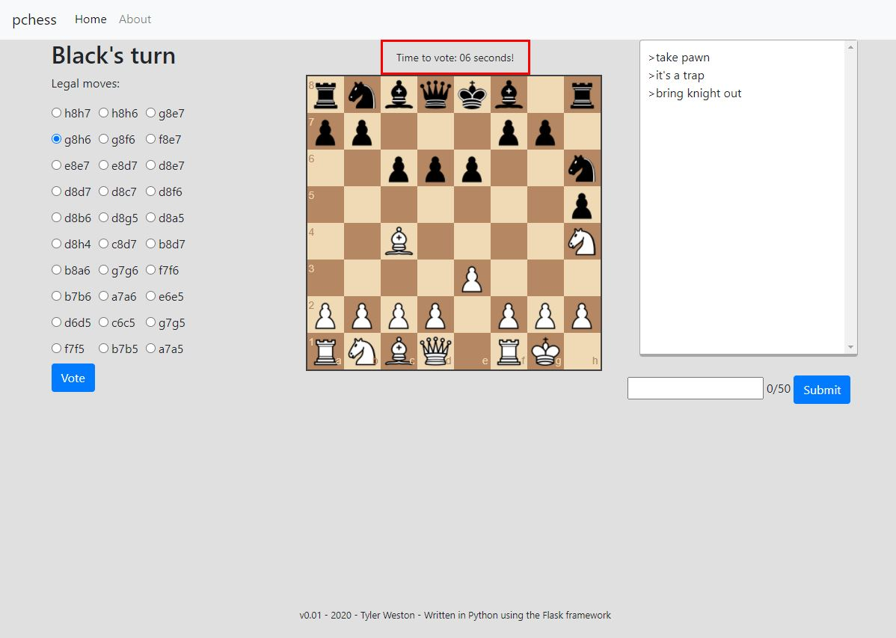

pchess v0.01
Tyler Weston

A democratic chess game. Vote on your favourite move and when the timer expires, the move with the most votes will get played!  
  


To play:  
- You can either drag pieces to select a move, or vote using the radio buttons on the left.  


### TODO: Test this  
Installation:
- Should be a matter of cloning the repo and running
```
docker-compose build
docker-compose up -d
```
and then popping over to `localhost:5000` and you should be able to test it out.  
  
Tests:  
Still a work in progress, but for now running `pytest` in the root directory will execute what little tests exists.
  
About the project:  
The backend is written in Python using the Flask framework. The votes and current game state is stored in a postgres database, using [flask-sqlalchemy](https://flask-sqlalchemy.palletsprojects.com/en/2.x/). Real time events are implemented using the celery library, backed with a redis database. The chess engine is [python-chess](https://python-chess.readthedocs.io/en/latest/) by Niklas Fiekas. The whole backend is coordinated using docker-compose.    
The frontend is written using the jinja template engine, with some javascript and jquery sprinkled in there. (It is using bootstrap, but I don't think I'm using any bootstrap functionality and will probably cut that eventually?). The chessboard used is [chessboard.js](https://chessboardjs.com/) by Chris Oakman.  
The backend and frontend communication with each other using [socketio-flask](https://flask-socketio.readthedocs.io/en/latest/) by Miguel Grinberg.   
